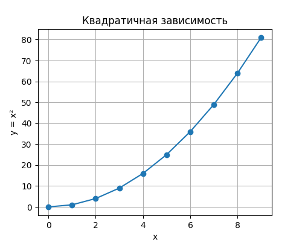

# Ежедневный отчёт

**Дата генерации:** 2025-06-02 12:38 UTC

---

## Таблица данных

<table border="1" class="dataframe">
  <thead>
    <tr style="text-align: right;">
      <th>x</th>
      <th>y</th>
    </tr>
  </thead>
  <tbody>
    <tr>
      <td>0</td>
      <td>0</td>
    </tr>
    <tr>
      <td>1</td>
      <td>1</td>
    </tr>
    <tr>
      <td>2</td>
      <td>4</td>
    </tr>
    <tr>
      <td>3</td>
      <td>9</td>
    </tr>
    <tr>
      <td>4</td>
      <td>16</td>
    </tr>
    <tr>
      <td>5</td>
      <td>25</td>
    </tr>
    <tr>
      <td>6</td>
      <td>36</td>
    </tr>
    <tr>
      <td>7</td>
      <td>49</td>
    </tr>
    <tr>
      <td>8</td>
      <td>64</td>
    </tr>
    <tr>
      <td>9</td>
      <td>81</td>
    </tr>
  </tbody>
</table>

---

## График зависимости

---

*Этот отчёт собран автоматически.*